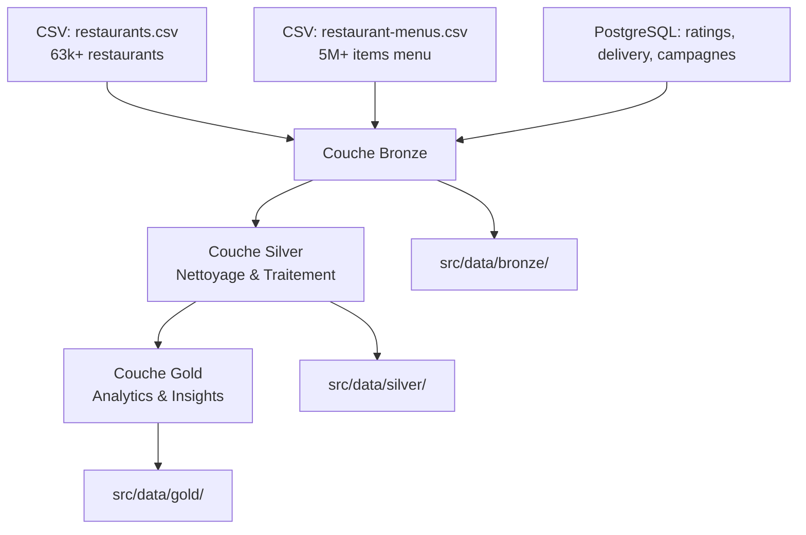

# Projet d'Analyse des Restaurants Uber Eats

## Vue d'ensemble

Projet d'analyse de données des restaurants Uber Eats aux États-Unis utilisant l'architecture médaillon (Bronze/Silver/Gold) avec Apache Spark et Scala.

**Jeu de données** : 63k+ restaurants + 5M+ items de menu (données réelles Kaggle) : [Dataset Kaggle](https://www.kaggle.com/datasets/ahmedshahriarsakib/uber-eats-usa-restaurants-menus/data) 
**Stack technique** : Scala 2.13 + Spark 3.5 + PostgreSQL + SBT  
**Architecture** : Lakehouse médaillon + paradigmes de programmation fonctionnelle

## Stack Technologique

<div align="center">

<a href="https://scala-lang.org/">
  
</a>
<a href="https://spark.apache.org/">
  
</a>
<a href="https://www.postgresql.org/">
  
</a>
<a href="https://www.scala-sbt.org/">
  
</a>

<a href="https://parquet.apache.org/">
  
</a>
<a href="https://github.com/lightbend/config">
  
</a>
<a href="https://www.python.org/">
  
</a>
<a href="https://git-scm.com/">
  
</a>

</div>

---

## Architecture du Projet

### Structure des Répertoires
```
EFREI_M1-Functional_Data_Programming-Projet_Final/
├── restaurants.csv                     # Jeu de données principal (63k restaurants) - non présent sur git
├── restaurant-menus.csv                # Jeu de données menus (5M+ items) - non présent sur git
│
├── src/
│   ├── main/scala/
│   │   ├── RestaurantAnalysisApp.scala # Point d'entrée principal
│   │   ├── layers/                     # Couches médaillon
│   │   │   ├── BronzeLayer.scala       # Ingestion données brutes
│   │   │   ├── SilverLayer.scala       # Transformation/nettoyage données
│   │   │   └── GoldLayer.scala         # Analytics/agrégations
│   │   └── utils/                      # Classes utilitaires
│   │       ├── Reader.scala            # Lecteurs de données 
│   │       ├── Writer.scala            # Écrivains de données
│   │       └── ConfigManager.scala     # Gestion de la configuration
│   ├── resources/
│   │   └── application.conf            # Configuration Spark/PostgreSQL
│   └── data/                           # Données traitées
│       ├── bronze/                     # Données brutes (CSV → Parquet)
│       ├── silver/                     # Données nettoyées
│       └── gold/                       # Données analytiques
│
├── scripts/                            # Scripts Python de setup
│   ├── 02_create_tables.sql            # SQL de création des tables (lancé par le script python)
│   ├── data_generator.py               # Génération données PostgreSQL
│   ├── requirements.txt                # Dépendances Python
│   └── README.md                       # Documentation scripts
│
├── docs/                               # Documentation
│   ├── TECHNICAL_DOCUMENTATION.md      # Documentation technique
│   ├── QUICK_START.md                  # Guide de démarrage rapide
│   └── CHANGELOG.md                    # Historique des versions
│
├── build.sbt                           # Configuration SBT
└── README.md                           # Ce fichier
```

### Architecture Médaillon



---

## Installation et Configuration

### Prérequis
- **Scala** 2.13.12
- **SBT** 1.9.7  
- **Java** 8 ou 11
- **PostgreSQL** (conteneur local-postgres sur port 54876)
- **Python** 3.7+ (pour la génération de données PostgreSQL)

### Configuration Rapide
```bash
# 1. Cloner le repository
git clone [repo-url]
cd EFREI_M1-Functional_Data_Programming-Projet_Final

# 2. Configuration PostgreSQL (une seule fois)
pip install -r requirements.txt
python scripts/data_generator.py --sample 100 --validate

# 3. Compilation Scala
sbt compile

# 4. Exécution du pipeline complet
sbt "runMain RestaurantAnalysisApp"
```

### Configuration
Toute la configuration est centralisée dans `src/main/resources/application.conf` :
- Paramètres Spark (mémoire, optimisations)
- Connexion PostgreSQL 
- Chemins sources et destinations
- Options des formats de fichiers

---

## Sources de Données

### restaurants.csv (10 MB)
- **63 000+ restaurants** d'Uber Eats USA
- **Colonnes** : id, name, score, ratings, category, price_range, full_address, lat, lng
- **Géographie** : Couverture complète des États-Unis

### restaurant-menus.csv (870 MB)
- **5 millions+ d'items de menu** détaillés
- **Colonnes** : restaurant_id, category, name, description, price
- **Lien** : `restaurant_id` pour les jointures

### PostgreSQL (généré automatiquement)
- **restaurant_ratings_history** : Évolution temporelle des notes
- **delivery_performance** : Métriques de livraison par restaurant
- **promotional_campaigns** : Campagnes marketing et efficacité

---

## Fonctionnalités Principales

### Couche Bronze - Ingestion
- Lecture optimisée de gros volumes (5M+ enregistrements)
- Validation des schémas de données
- Conversion CSV → Parquet pour les performances
- Intégration multi-sources (CSV + PostgreSQL)

### Couche Silver - Transformation
- Nettoyage et normalisation des données
- Enrichissement géographique (états, villes)
- Jointures complexes restaurants ↔ menus ↔ métriques
- Calculs de métriques dérivées

### Couche Gold - Analytics
- Analyses géographiques par état/région
- Corrélations prix/popularité/géolocalisation
- Tendances temporelles des performances
- Recommandations business basées sur les données

---

## Tests et Validation

### Tests Unitaires
```bash
sbt test
```

### Test Complet avec Échantillon
```bash
# PostgreSQL avec 100 restaurants
python scripts/data_generator.py --sample 100 --validate

# Exécution du pipeline complet
sbt "runMain RestaurantAnalysisApp"

# Vérification des résultats
ls src/data/bronze/ src/data/silver/ src/data/gold/
```

---

## Documentation

- **[docs/TECHNICAL_DOCUMENTATION.md](docs/TECHNICAL_DOCUMENTATION.md)** : Documentation technique
- **[docs/QUICK_START.md](docs/QUICK_START.md)** : Guide de démarrage rapide 5 minutes
- **[docs/CHANGELOG.md](docs/CHANGELOG.md)** : Historique des versions et roadmap
- **[scripts/README.md](scripts/README.md)** : Documentation des scripts PostgreSQL

---

**EFREI M1 - Fuunctional Data Programming - 2025**
